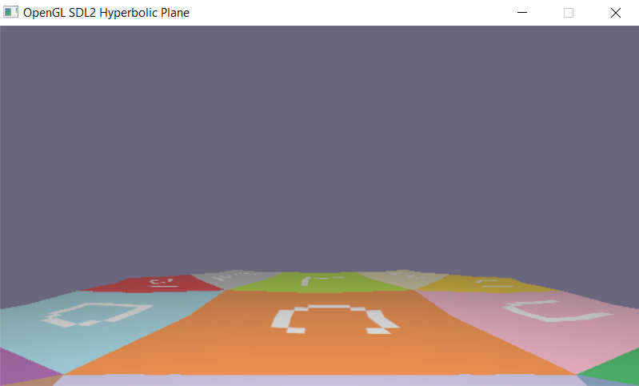

# HyperbolicTileMappingC++
Implementation of [Hyperbolic Tile Mapping](https://github.com/paulogcosta/HyperbolicTileMapping) using OpenGL, SDL2 and C++

## Build
Using Windows, make sure you have [msys2](https://www.msys2.org/) installed.

Open the folder containing the makefile and run the command:
```
make
```


